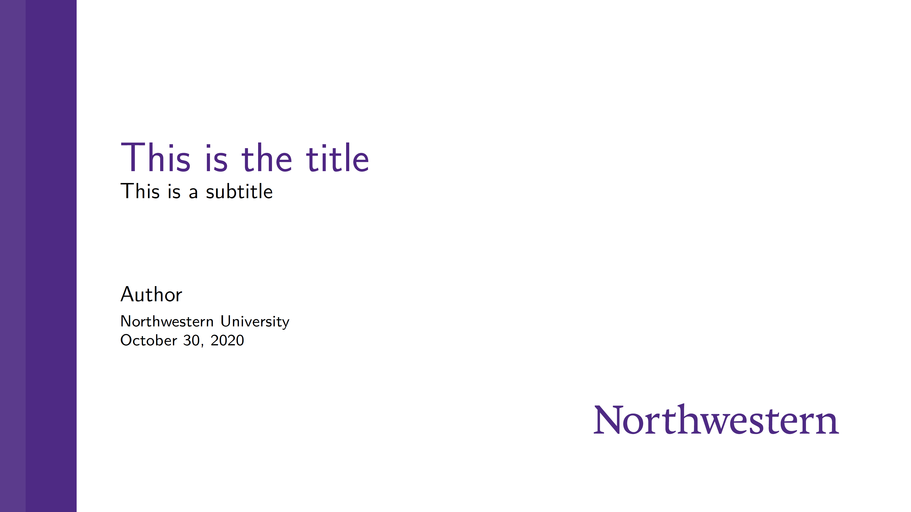

# Beamer template for Northwestern University

This is a beamer implementation of the *Traditional White with Purple* design of *Northwestern University-approved PowerPoint templates*: 
https://www.northwestern.edu/brand/resources/downloadable-assets/power-point-templates/

This template is built on top of a previous NU/Kellogg template:
https://sites.google.com/site/rohitpatelecon/beamer-themes/northwestern-beamer-theme

This is what it looks like:

Please report bugs in issue.
